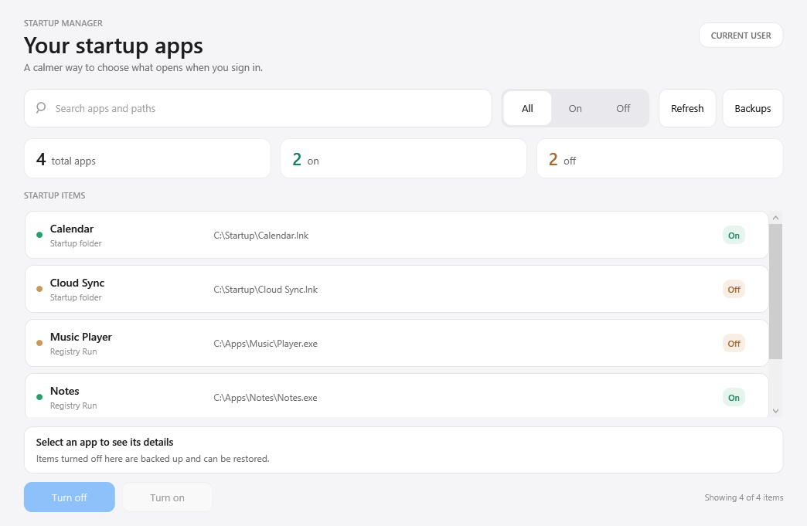

# Community Startup Manager

**A simple, reversible way to choose what starts with your Windows account.**

Search your startup items, see what is on or off, and change an item with one click. The light, rounded interface is built with Windows Presentation Foundation and has no installer or third-party runtime.



> **Scope:** This app manages the signed-in user's `Run` registry values and personal Startup folder. It does not manage services, scheduled tasks, system-wide entries, or packaged-app startup tasks.

## Download and use

1. Download **`CommunityStartupManager.exe`** from the [latest release](https://github.com/ayatvfx/community-startup-manager/releases/latest).
2. Double-click the EXE. There is no installer.
3. Search or use **All / On / Off** to find an item. Select it, then click **Turn off** or **Turn on**.
4. Sign out and back in (or restart Windows) to see the startup change. Turning an item off does not close an app already running.

Prefer a readable script package? Download `CommunityStartupManager.zip`, extract it, and double-click `Launch.cmd`. Keep `StartupManager.ps1` and `App.xaml` together. Both ways use the same backup location.

Requires Windows with Windows PowerShell 5.1 and WPF. The EXE embeds the PowerShell script and XAML layout, extracts them temporarily, and runs them with the built-in Windows PowerShell. No administrator privileges are needed for the supported current-user entries. The app runs locally; it does not send data anywhere.

The EXE and script launcher use `powershell.exe -NoProfile -ExecutionPolicy Bypass -File` for this run so that the script can start on systems with the default script execution policy. The EXE is unsigned, so Windows may display a warning. The repository includes the full source and build script for review.

## What gets changed?

| Source | Turn off | Turn on |
| --- | --- | --- |
| `HKCU\Software\Microsoft\Windows\CurrentVersion\Run` | Save the value and its type, then remove the active value | Restore the saved value, unless a value with that name now exists |
| Your personal Startup folder | Move the file into the app's backup folder | Move it back, unless a file with that name now exists |

Backups live at `%LOCALAPPDATA%\CommunityStartupManager`. The **Backups** button opens that folder. Nothing is permanently deleted by **Turn off**. The app leaves conflicting names alone rather than overwriting them.

To restore one item, use **Turn on** in either version. To restore all items saved by this app, extract the ZIP and run **`Restore-All.cmd`**. Keep the backup folder until you have restored everything you want.

## Troubleshooting

- **An app still starts:** Check whether it also has a scheduled task, service, system-wide entry, or a startup setting inside the app itself. Those sources are not covered here.
- **An app is still open after Turn off:** This changes its next sign-in, not the current session.
- **Turn on reports a name collision:** Another entry or file now has the original name. The saved backup remains untouched. Inspect both before resolving the conflict.
- **A security warning appears:** This is an unsigned PowerShell community project. You can inspect the source and run `StartupManager.ps1` directly instead of using the launcher.

## Develop and test

The startup logic is in `StartupManager.ps1`; the visual layout is in `App.xaml`. `Launcher.cs` embeds both files in the EXE; `Build-Exe.ps1` compiles it using the Windows .NET Framework C# compiler.

```powershell
powershell.exe -NoProfile -ExecutionPolicy Bypass -File .\StartupManager.ps1 -SelfTest
powershell.exe -NoProfile -ExecutionPolicy Bypass -File .\StartupManager.ps1 -UiSmokeTest
powershell.exe -NoProfile -ExecutionPolicy Bypass -File .\Build-Exe.ps1
```

The self-test creates temporary registry and Startup-folder fixtures, disables them, restores them, verifies their exact values/content, and cleans them up. The UI smoke test checks loading, search, and filters without changing startup entries. The [Windows CI](.github/workflows/windows-test.yml) also builds and tests the EXE.

`Revert-UI.cmd` restores the previous WinForms interface from `StartupManager.previous.ps1` in the script package. It changes only the UI script, not startup entries or the standalone EXE.

## Contributing

Bug reports, accessibility improvements, translations, and support for additional startup sources are welcome. See [CONTRIBUTING.md](CONTRIBUTING.md). If this tool helps you, a GitHub star makes it easier for others to find.

MIT licensed. See [LICENSE](LICENSE).
